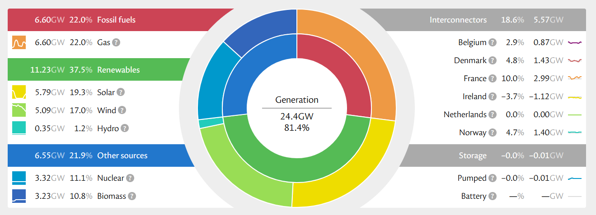

# UK Energy Reliability Tool

*Capstone Project Proposal*

## Part 1: The Big Picture

### 1. What's the idea, and why does it matter to me?

Every half hour, Great Britain's electricity comes from a changing mix of wind, solar, nuclear, gas, storage and imports. My tool aims to forecast when the supply-demand margin is likely to become tight over the next 24 hours, then uses GenAI to explain the drivers in plain English. The aim is to turn excellent open energy data into decision support, not another live data dashboard.

The project combines three things I am particularly interested in: the development of the UK energy grid, applied data/AI, and building something with a credible user and business case. It also lets me learn a partially new domain through hands-on API and modelling work.

### 2. Who is this for?

Primary users are flexible-load businesses (for example manufacturers, EV fleets and data centres), sustainability/ESG teams, and government energy analysts. Today they either interpret live dashboards manually or operate to fixed schedules. A forward-looking signal could help them time activity, understand low-carbon conditions and identify areas where generation capacity is tight. Kate Morley’s National Grid: Live reports 22,041,224 visits over the past year, providing direct evidence of strong demand for accessible grid information.

### 3. What already exists?

Kate Morley's National Grid: Live is the clearest comparator: an excellent visualisation of current and historical generation, transfers and storage. Its strength is clarity; the opportunity for this project is the next step: forecasting future margin tightness and explaining what is driving it.

*Fig. 1 - Kate Morley's "National Grid: Live", showing GB generation mix, interconnector flows and storage.*

| Dimension | National Grid: Live | This project |
|---|---|---|
| Time | Present / historical | Next 24 hours |
| Method | Visualises published values | Regression forecast vs naive baseline |
| Output | Charts for the reader to interpret | Risk signal + grounded GenAI briefing |

### 4. What are my assumptions?

- NESO, Elexon and Open-Meteo data can be joined reliably despite timestamp and region conventions; the NESO 18-entry regional response has already been identified and accounted for.
- Regional demand is available at sufficient granularity. This is the key open assumption; if not, the MVP falls back to national-level forecasting and regional analysis becomes stretch scope.
- A true shortfall classifier is not a useful core target because genuine shortfalls are extremely rare. The target has therefore been reframed as continuous margin tightness (regression).
- GenAI can stay grounded to supplied figures; this will be tested through constrained prompts and manual spot-checks. Sustained API behaviour will also be tested before bulk use.

## Part 2: Designing the Story

### 5. What is the paradigm for this use case?

The project combines data storytelling, predictive modelling and GenAI. The dashboard makes the grid understandable; a regression model predicts 24-hour supply-demand margin tightness; and GenAI converts the forecast and its drivers into a short, non-alarmist briefing for a non-specialist user.

#### Data Analysis / Predictive Modelling

- **Metrics:** Mean Absolute Error (MAE) and Root Mean Squared Error (RMSE), tested on later historical data that the model has not seen during training. This mirrors the real-world task: learning from the past to predict what happens next.
- **Expertise:** I do not have professional energy-sector expertise, so grid concepts and methodology will be grounded in NESO/Elexon documentation. This is a deliberate learning component of the project.
- **Build steps:** ingest/store data → join weather (stretch) and price → engineer lag/rolling/cyclical features → train/validate regression → generate briefing → present in Streamlit. Stretch: REPD project-pipeline gap analysis and regional comparison.

#### Generative AI

- **Core job:** Generate a concise plain-English explanation from structured model outputs; stretch scope adds Reason/Decide over REPD project data.
- **Input/output:** structured numeric forecast, baseline and feature context in; short dashboard briefing out. No open-ended user text is required. Outputs are spot-checked during development.
- **Context:** no classic RAG, no LLM tool-calling and no cross-session memory. The application calls the APIs; the LLM receives only the selected facts plus a system prompt requiring a factual, non-alarmist tone and prohibiting invented figures.
- **Components/failure points:** NESO/Elexon/Open-Meteo → SQL → scikit-learn model → structured OpenRouter prompt → Streamlit. Risks are API/schema changes, timestamp alignment, hallucinated numbers and live API downtime; mitigations are schema checks, alignment tables, constrained prompting/spot-checks and a cached demo dataset.

## Part 3: Defining Done

### 6. What does a successful demo look like?

A user opens the Streamlit dashboard, sees recent grid context and a 24-hour margin forecast, then reads a GenAI briefing that accurately explains the forecast using only supplied values. The model is shown against its naive baseline so the audience can see whether the predictive layer adds value. If regional data is viable, the demo can compare locations; otherwise it works cleanly at national level.

### 7. What does failure look like?

Failure would be a model that does not beat the naive baseline, data joins that misalign regions/times, a briefing that invents or contradicts figures, or a live demo that depends on an unavailable API. Before the demo I will validate the holdout metrics, test joins and edge cases, spot-check generated briefings, and keep a cached fallback dataset.

### 8. What is the Minimum Viable Version?

The smallest version that demonstrates the core idea is national-level data ingestion, a working dashboard, and a validated 24-hour margin regression. GenAI briefings, regional comparison, shortfall classification and REPD gap analysis are stretch features, not dependencies, below is a full table including complex stretch goals that’re out-of-scope but nice-to-have.

| Feature | What it demonstrates | Scope |
|---|---|---|
| Data + dashboard | NESO/Elexon ingestion and clear visual context | MVP |
| 24h margin forecast | Regression model, time-based validation, naive baseline | MVP |
| GenAI briefing | Grounded explanation of forecast/drivers | Stretch |
| Regional comparison / classifier / REPD | Additional analysis if time and data allow | Stretch |
| Weather data integration | Complex data wrangling | Stretch |
| GenAI brief analysis | Capability to integrate less structured data | Stretch |
| GenAI chatbot to talk about capacity for new builds | Data hook-up with consumer facing interface | Stretch |

## Sources

The following are the primary data and comparison sources used in the proposal. Titles are clickable links.

- [NESO Carbon Intensity API](https://api.carbonintensity.org.uk/) — Official GB carbon-intensity and generation-mix API.
- [NESO Data Portal](https://www.neso.energy/data-portal) — National Energy System Operator open-data catalogue and API.
- [Elexon Insights Solution Developer Portal](https://developer.data.elexon.co.uk/) — Public electricity-market API documentation; no API key required.
- [Open-Meteo API](https://open-meteo.com/en/docs) — Weather data used for feature engineering.
- [Kate Morley - National Grid: Live](https://grid.iamkate.com/) — Comparable live/historical GB grid dashboard shown in Fig. 1; source for the reported annual visit count.
- [DESNZ Renewable Energy Planning Database (REPD)](https://www.gov.uk/government/publications/renewable-energy-planning-database-quarterly-extract) — Planned renewable-project pipeline for stretch-scope gap analysis.
